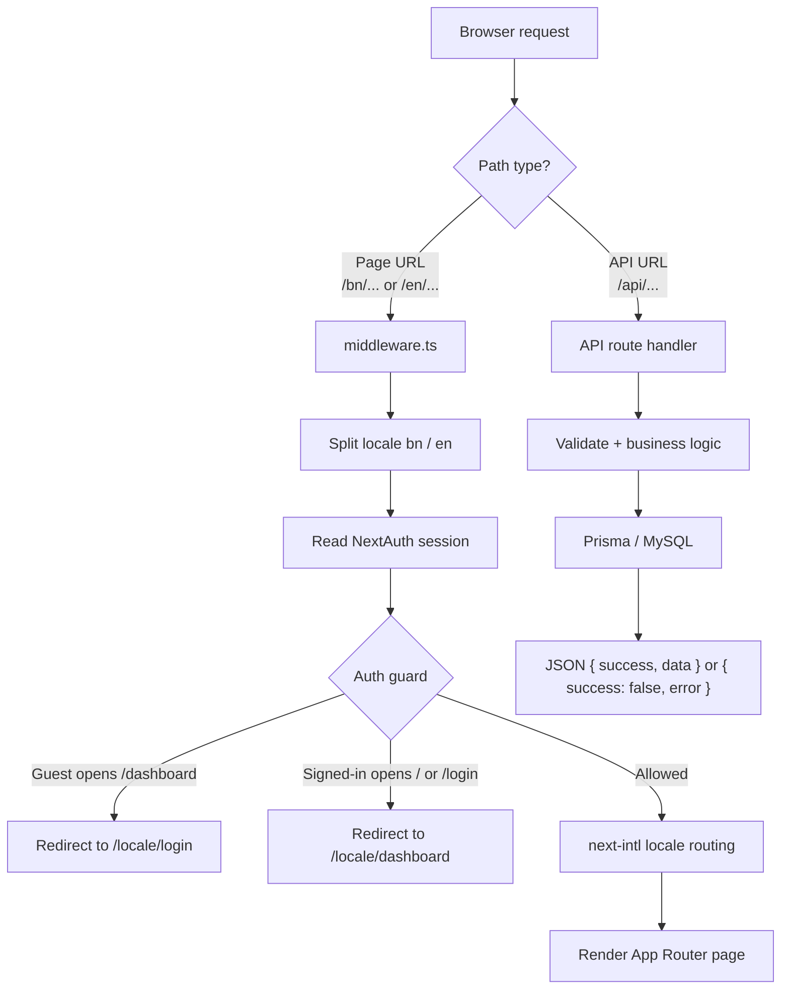
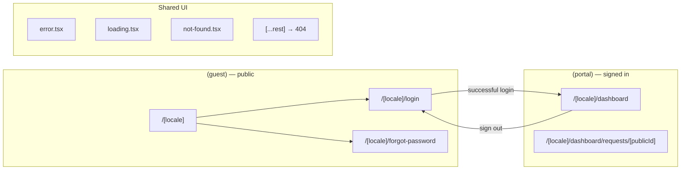
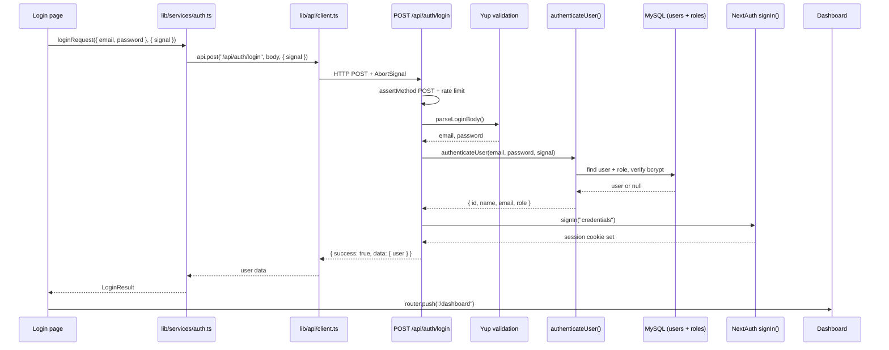
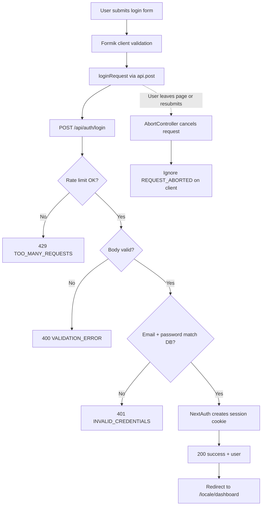
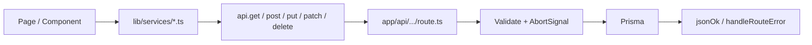
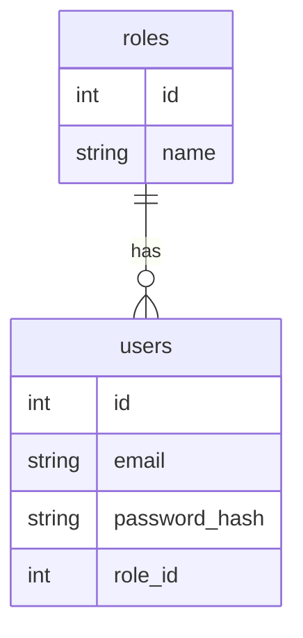

# Assunnah Foundation Service Portal — Workflow

How routes, middleware, and API calls work in this project.

## High-level flow



## App routes



| URL | File | Access |
|---|---|---|
| `/[locale]` | `app/[locale]/(guest)/page.tsx` | Guest → redirects to login |
| `/[locale]/login` | `app/[locale]/(guest)/login/page.tsx` | Guest |
| `/[locale]/forgot-password` | `app/[locale]/(guest)/forgot-password/page.tsx` | Guest |
| `/[locale]/dashboard` | `app/[locale]/(portal)/dashboard/page.tsx` | Signed in |
| `/[locale]/dashboard/requests/[publicId]` | `app/[locale]/(portal)/dashboard/requests/[publicId]/page.tsx` | Signed in (role-scoped) |
| `/[locale]/*` unknown | `app/[locale]/[...rest]/page.tsx` | Any → 404 |

Locales: `bn` (default), `en`. Route groups `(guest)` and `(portal)` are not part of the URL.

## Login API call flow



## Login flowchart (simplified)



## API pattern for every future endpoint



**Client**

```ts
import { api, useAbortableRequest } from "@/lib/api";

const abortable = useAbortableRequest();
await api.post("/api/...", body, { signal: abortable.nextSignal() });
```

**Server**

```ts
import { assertMethod, throwIfAborted, jsonOk, handleRouteError } from "@/lib/api";
```

## Auth-related APIs

| Method | Path | Role |
|---|---|---|
| `POST` | `/api/auth/login` | App login (validate, DB, session) |
| `GET/POST` | `/api/auth/[...nextauth]` | NextAuth CSRF, session, callbacks |

## Data used by login today



Seeded roles: `admin`, `manager`, `office`, `requester`.  
Other tables (`services`, `service_requests`, `service_activities`) are ready for portal features next.
